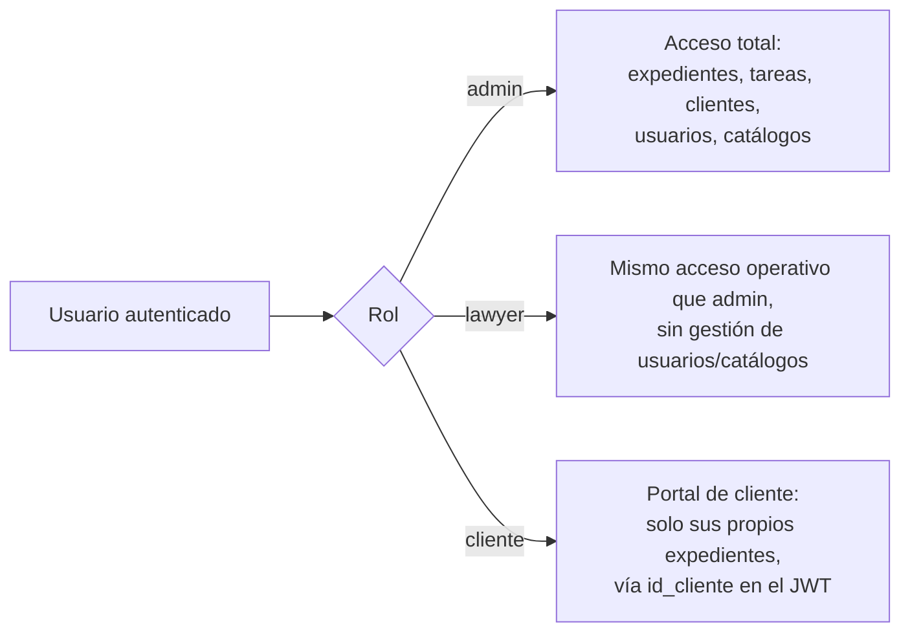
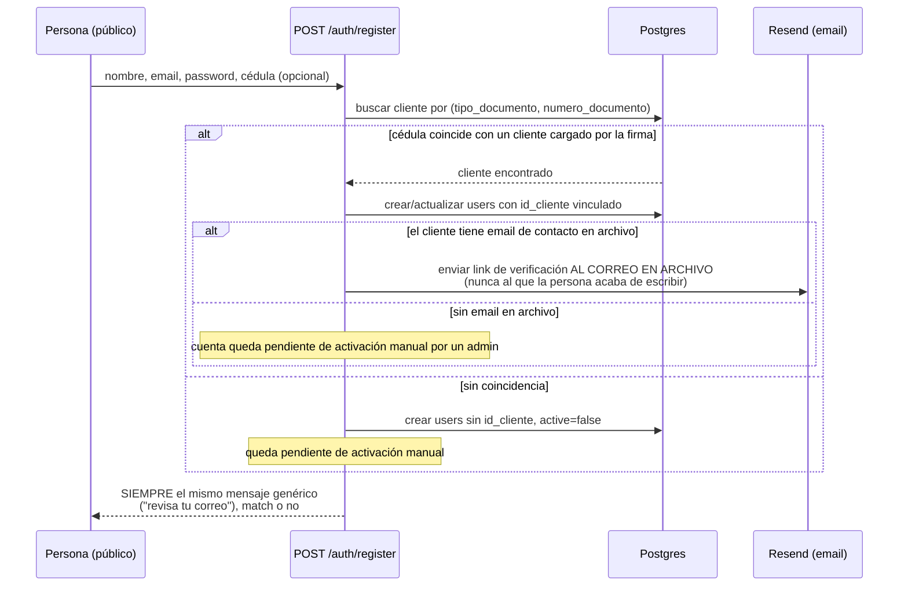
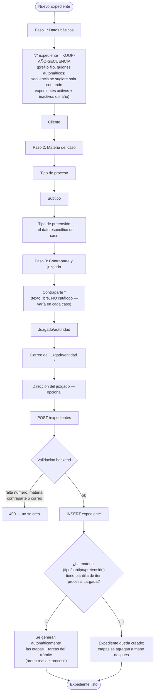
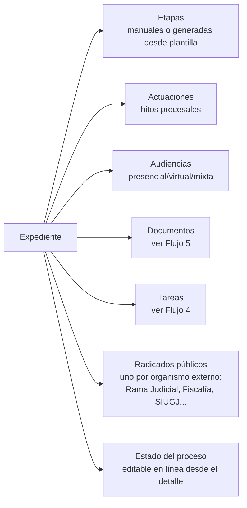
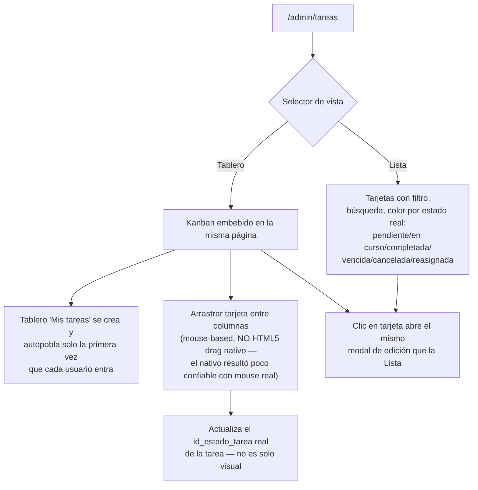
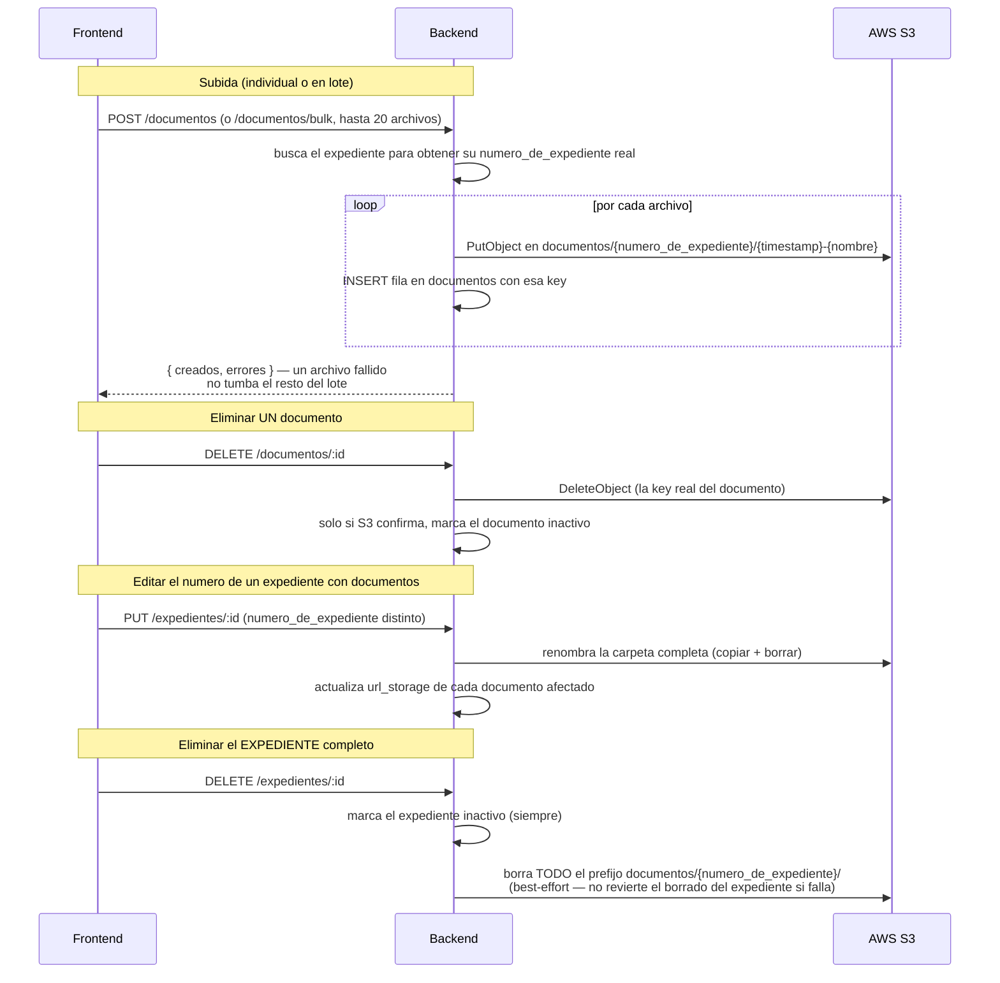
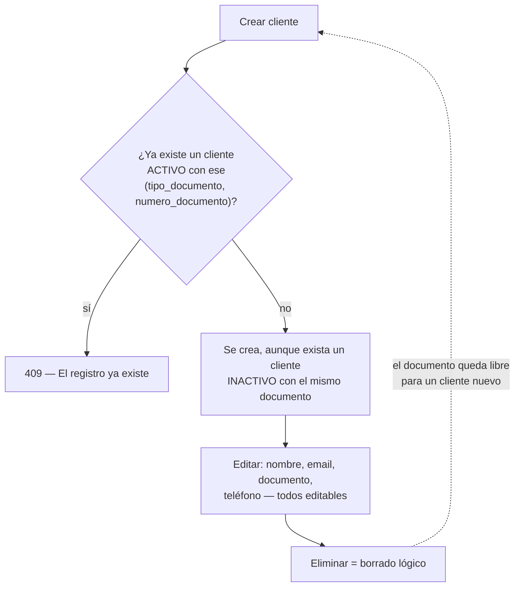
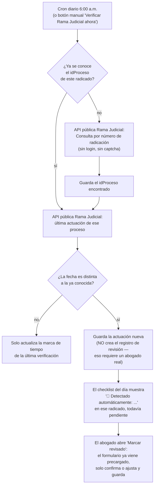

# Koop Strategic Advisory — Sistema de gestión jurídica

Aplicación interna de la firma para gestionar expedientes, tareas, documentos y clientes. Este documento describe **los flujos reales que ya están implementados y en uso**, no un plan a futuro.

## Arquitectura

| Capa | Tecnología |
|---|---|
| Backend | Node.js + Express, patrón repositorio (`src/repositories`) + feature-slice (`src/features/<dominio>/<accion>.js`) |
| Base de datos | PostgreSQL real (no Mongo, no PGlite embebido) |
| Frontend | React + Vite, monorepo Turborepo (`v2/front`), app principal en `apps/koop` |
| Almacenamiento de archivos | AWS S3, un bucket, prefijo por expediente |
| Autenticación | JWT (access token 15 min + refresh token 7 días en cookie httpOnly) |

Cada entidad de negocio usa **borrado lógico** (`active boolean`, default `true`) en vez de `DELETE` — "eliminar" un registro lo marca `active = false`, no lo saca de la base de datos. Esto es intencional (trazabilidad/auditoría) y aparece una y otra vez en los flujos de abajo.

## Roles y acceso

El JWT de acceso lleva `roles` e `id_cliente` (si la cuenta está vinculada a un cliente de la firma). Un middleware de alcance (`scopeExpedientesQuery`) usa ese `id_cliente` para forzar el filtro cuando quien pide es un usuario solo-cliente — no depende de que el frontend mande el filtro correcto.

---

## Flujo 1 — Registro y auto-vinculación de cliente

El punto más delicado del sistema: cuando alguien se registra desde el sitio público, el backend intenta **encontrarlo automáticamente** entre los clientes que la firma ya cargó (por cédula), sin nunca revelar si esa cédula pertenece a alguien.

**Por qué la respuesta es siempre igual:** si el mensaje cambiara según hubo match o no, cualquiera podría probar cédulas al azar y usar la respuesta para averiguar quién es cliente de la firma. El link de verificación real solo lo ve quien tiene acceso a la bandeja de correo ya registrada — conocer la cédula de alguien no es suficiente para entrar a su expediente.

También reintentos: si alguien vuelve a registrarse (mismo correo o misma cédula) antes de activar la cuenta anterior, se reutiliza esa fila pendiente en vez de chocar con "el email ya existe" — un problema real que pasaba seguido con errores de tipeo.

---

## Flujo 2 — Creación de un expediente

Campos obligatorios al crear: **número de expediente, cliente, materia, contraparte, correo del juzgado/entidad**. La dirección del juzgado es el único dato opcional de ese bloque.

La generación automática de etapas es *best-effort*: si la materia todavía no tiene una plantilla cargada en el catálogo de iter procesal, simplemente no genera nada — no es un error, el expediente queda creado igual.

---

## Flujo 3 — Ciclo de vida de un expediente

Todas estas sub-entidades cuelgan de `id_expediente`. Eliminar el expediente (borrado lógico) **no** las elimina automáticamente en la base de datos — solo los documentos en S3 se limpian de verdad (ver Flujo 5); el resto queda huérfano pero invisible porque el expediente padre ya no aparece en los listados.

---

## Flujo 4 — Tareas: lista y tablero Kanban unificados

Antes el Kanban era una página aparte (`/admin/kanban`) sin relación visible con la lista de tareas, aunque eran el mismo dato. Ahora es una sola pantalla con un selector de vista.

El color de cada tarjeta/columna sale directo del catálogo real de `estado_tarea` (no es un binario hecho/pendiente inventado). Tanto la Lista como el Tablero comparten el mismo hook de datos y el mismo modal de edición — no hay dos formularios distintos que puedan desincronizarse.

---

## Flujo 5 — Documentos: subida y eliminación con S3

Esto corrigió dos problemas reales: (1) antes "eliminar" solo cambiaba `active` en la base de datos y el archivo se quedaba en S3 para siempre, visible únicamente entrando directo a la consola de AWS; (2) la carpeta en S3 se llamaba `expediente-<id interno>` (ej. `expediente-17`), que no dice nada fuera del sistema — ahora se llama como el número real del expediente (ej. `KOOP-2026-3`), y si ese número se corrige después, la carpeta se renombra sola.

---

## Flujo 6 — Gestión de clientes

El índice de unicidad de `(tipo_documento, numero_documento)` es **parcial** (`WHERE active`), no de toda la tabla — un cliente eliminado no bloquea para siempre volver a crear a esa misma persona si se equivocaron en un dato y tuvieron que borrar y rehacer el registro.

---

## Flujo 7 — Consultas externas diarias y verificación automática de Rama Judicial

Cada radicado público activo (Rama Judicial, Fiscalía, SIUGJ...) debe revisarse a diario en su portal externo. El checklist solo muestra radicados que realmente existen — un expediente sin radicado público (ej. un trámite notarial) nunca aparece ahí.

**Por qué solo Rama Judicial:** se encontró que su portal (`consultaprocesos.ramajudicial.gov.co`) tiene una API JSON pública real detrás del formulario, sin captcha ni login. Fiscalía, SIUGJ y SuperFinanciera sí piden captcha o autenticación, así que sus radicados se siguen revisando a mano como siempre.

**Por qué no se autocompleta la revisión:** `consulta_externa_diaria` (la bitácora) exige un usuario real — es la constancia de que *una persona* revisó el proceso, no solo el sistema. La automatización deja la novedad lista para que el abogado la confirme con un clic, pero no reemplaza esa constancia.

---

## Otros módulos del backend

Implementados como CRUD (crear/listar/ver/editar/eliminar) sobre su propia tabla, montados en `src/index.js`:

| Módulo | Qué gestiona |
|---|---|
| `iter-procesal` | Catálogo de "plantillas de trámite" (orden real de etapas y tareas por tipo de proceso) — es lo que usa el Flujo 2 para autogenerar etapas |
| `actuaciones` | Hitos procesales dentro de un expediente |
| `audiencias` | Audiencias programadas/celebradas, con modalidad y resultado |
| `notificaciones` | Notificaciones judiciales/administrativas ligadas a un expediente |
| `consultas-externas` | Registro de consultas hechas a portales externos (Rama Judicial, etc.) y sus PDFs |
| `financiero` | Honorarios, pagos y gastos por expediente, con resumen |
| `colaboracion` | Comentarios, adjuntos, etiquetas y dependencias entre tareas |
| `catalogos` | Catálogos param con CRUD genérico (roles, tipo de proceso, prioridad, tipo de documento, etc.) |

Estos módulos tienen API completa en el backend; este documento se enfoca en los flujos de negocio (1–6) que están además construidos y verificados de punta a punta en el frontend.

---

## Convenciones que vale la pena conocer

- **`numero_de_expediente`** siempre tiene el formato `KOOP-AÑO-SECUENCIA`, armado por el frontend a partir de dos campos separados — nunca texto libre.
- **`contraparte`** en expediente es texto plano, no un catálogo — se escribe cada vez porque varía caso a caso.
- Los identificadores numéricos de Postgres (`bigint`) llegan como **strings** en JSON; las comparaciones en frontend usan `String(a) === String(b)`, nunca `===` directo.
- Todas las claves de S3 siguen el patrón `documentos/{numero_de_expediente}/{timestamp}-{nombre-sanitizado}` (ej. `documentos/KOOP-2026-3/...`) — es lo que permite purgar por prefijo al borrar un expediente completo, y renombrar la carpeta si el número de expediente cambia.
